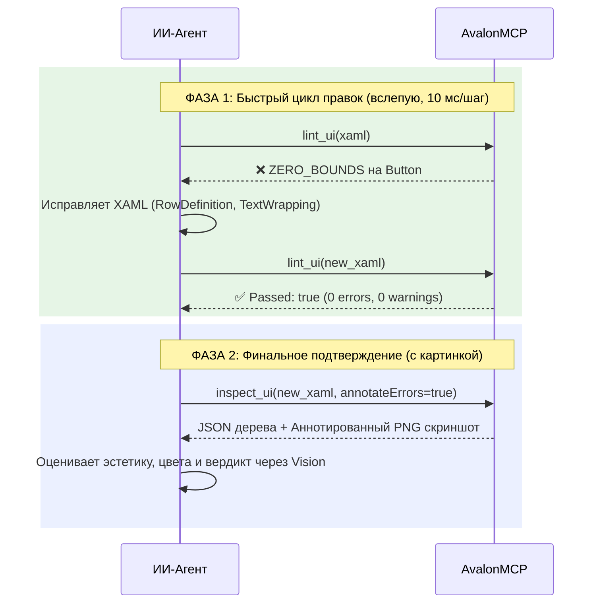

# AvalonMCP: Руководство для ИИ-агента (Agent Handbook)

> **Назначение**: Полное практическое руководство для ИИ-агентов (Antigravity, Cursor, Claude, Windsurf, Copilot) по отладке, верстке и инспекции интерфейсов на Avalonia UI с использованием сервера **AvalonMCP**.

---

## 1. Зачем нужен этот сервер?

При разработке интерфейсов на Avalonia UI ИИ-агенты сталкиваются с тремя ограничениями:
1. **Официальный XAML Previewer платный** (Avalonia Pro) и недоступен агенту.
2. **Анализ только по скриншотам медленный** (2–6 секунд на генерацию и передачу тяжелых растровых картинок).
3. **Spatial Blindness (пространственная слепота нейросетей)**: языковые модели плохо замечают по картинкам обрезку текста на пару пикселей, схлопывание контролов в `0x0` или случайное наложение элементов в одной строке `Grid`.

**AvalonMCP решает эти проблемы через Headless-движок (в памяти) и встроенный Layout Linter.**

---

## 2. Золотое правило агента: Двухфазный цикл верстки (Fast-Loop)

Агент **не должен** запрашивать скриншот на каждое микро-изменение XAML. Это тратит контекстное окно и замедляет работу.



### Фаза 1: Быстрая правка через `lint_ui` (Без картинок, 5–15 мс)
1. Вы создали или отредактировали `.axaml` файл.
2. Немедленно вызовите инструмент `lint_ui`.
3. Проверьте поле `Passed`:
   * Если `false`: прочитайте массив `Diagnostics`. В нем будут точные имена элементов, координаты и конкретный совет (`Suggestion`), как исправить проблему.
   * Внесите правки в XAML и повторите вызов `lint_ui`.

### Фаза 2: Финальный снимок через `inspect_ui` (Один раз в конце)
1. Когда `lint_ui` вернул `Passed: true`, вызовите `inspect_ui`.
2. Инструмент вернет:
   * **Дерево элементов (JSON)**: точные координаты (`bounds`, `absoluteBounds`), отступы (`margin`), выравнивания и текст.
   * **PNG-скриншот (Base64)**: если какие-то предупреждения остались, на картинке прямо поверх контролов будут нарисованы полупрозрачные цветные рамки с подписями ошибок!

---

## 3. Справочник инструментов (Tools Reference)

### 3.1. `lint_ui` (Самый быстрый инструмент, 5–15 мс)
Мгновенно проверяет геометрию в памяти без рендера картинки.

* **Параметры**:
  * `xaml` (string, обязательный): строка AXAML.
  * `width` (number, по умолчанию `1024`): ширина вьюпорта.
  * `height` (number, по умолчанию `768`): высота вьюпорта.
  * `theme` (string, опционально): `"dark"` или `"light"` (по умолчанию светлая тема Avalonia Fluent).
  * `assemblyPath` (string, опционально): путь к скомпилированной `.dll` проекта, если XAML использует кастомные контролы или `x:Class`.
* **Пример ответа**:
  ```json
  {
    "Passed": false,
    "ErrorCount": 1,
    "WarningCount": 1,
    "Diagnostics": [
      {
        "Code": "ZERO_BOUNDS",
        "Severity": 1,
        "TargetType": "Button",
        "TargetName": "SubmitButton",
        "Bounds": { "X": 0, "Y": 0, "Width": 0, "Height": 0 },
        "Message": "Button 'SubmitButton' with content collapsed to zero size (0x0).",
        "Suggestion": "Check parent Grid Row/Column definitions (e.g. Star vs Auto), HorizontalAlignment/VerticalAlignment, or set explicit MinWidth/MinHeight."
      },
      {
        "Code": "TEXT_CLIPPED",
        "Severity": 0,
        "TargetType": "TextBlock",
        "TargetName": "HeaderLabel",
        "Message": "Text 'Добро пожаловать в систему' is clipped by ~45px.",
        "Suggestion": "Enable TextWrapping='Wrap', add TextTrimming='CharacterEllipsis', or increase container width."
      }
    ],
    "Summary": "Found 1 error(s) and 1 warning(s)."
  }
  ```

---

### 3.2. `inspect_ui` (Комбинированный инструмент)
Возвращает визуальное дерево, диагностический отчет и PNG-скриншот за один вызов.

* **Параметры**:
  * `xaml` (string, обязательный).
  * `width` (number, default `1024`).
  * `height` (number, default `768`).
  * `theme` (string, `"dark"` / `"light"`).
  * `assemblyPath` (string, опционально).
  * `annotateErrors` (boolean, default `true`): при `true` автоматически рисует красные/оранжевые рамки и бейджи на скриншоте вокруг проблемных мест.
* **Структура ответа**:
  * `content[0]` (text): JSON с полным деревом элементов (`tree`) и отчетом линтера (`diagnostics`).
  * `content[1]` (image): изображение `image/png` в Base64.

---

### 3.3. `render_ui_snapshot`
Рендерит AXAML и возвращает только изображение `image/png`.
* Поддерживает `annotateErrors` (по умолчанию `true`), `theme`, `width`, `height`.

---

### 3.4. `get_ui_tree`
Возвращает только чистое JSON-дерево контролов со всеми координатами:
```json
{
  "type": "Avalonia.Controls.Button",
  "name": "OkBtn",
  "classes": ["accent"],
  "text": "Применить",
  "isVisible": true,
  "isEnabled": true,
  "bounds": { "x": 10, "y": 20, "width": 100, "height": 32 },
  "absoluteBounds": { "x": 110, "y": 220, "width": 100, "height": 32 },
  "margin": { "left": 10, "top": 5, "right": 10, "bottom": 5 },
  "horizontalAlignment": "Center",
  "verticalAlignment": "Center",
  "children": [ ... ]
}
```

---

### 3.5. `discover_project` & `build_project`
Используются, когда в проекте есть кастомные стили, конвертеры или контролы:
* `discover_project(path)`: найдет файл `.csproj` или `.sln`, а также пути к `.axaml`.
* `build_project(path, timeoutSeconds)`: скомпилирует проект в фоне и вернет путь к готовой `.dll`.

---

## 4. Шпаргалка по кодам ошибок линтера

| Код ошибки | Уровень | В чем причина? | Как исправить в XAML? |
|---|---|---|---|
| `ZERO_BOUNDS` | **Error** | Кнопка, картинка, поле ввода или панель получили размер `0x0` пикселей. Элемент физически не виден на экране. | Проверьте `RowDefinitions`/`ColumnDefinitions` у родительского `Grid` (возможно, строка имеет размер `0` или `Auto` для пустого элемента). Задайте явный `Height`, `Width` или `MinHeight`. |
| `TEXT_CLIPPED` | **Warning** | Текст шире контейнера и обрезается границей. | Добавьте `TextWrapping="Wrap"`, `TextTrimming="CharacterEllipsis"` или увеличьте ширину родительского блока. |
| `UNINTENDED_OVERLAP` | **Error** | Два контрола в `Grid` наложились друг на друга, потому что делят одну ячейку. | Укажите правильные `Grid.Row="..."` и `Grid.Column="..."` для каждого элемента. |
| `ASYMMETRIC_MARGIN` | **Warning** | Элемент с `HorizontalAlignment="Center"` имеет большой несимметричный отступ (например, `Margin="80,0,0,0"`), из-за чего визуально съезжает с центра. | Используйте равномерный `Margin="10"` или смените выравнивание на `HorizontalAlignment="Left"`. |
| `VIEWPORT_OVERFLOW` | **Warning** | Элементы выходят за пределы окна приложения (например, высота списка 900px при окне 768px). | Оберните содержимое в `<ScrollViewer>`. |

---

## 5. Работа со сложными проектами (кастомные контролы и x:Class)

Если ваш `.axaml` содержит привязку к классу:
```xml
<UserControl xmlns="https://github.com/avaloniaui"
             xmlns:x="http://schemas.microsoft.com/winfx/2006/xaml"
             x:Class="MyAwesomeApp.Views.UserProfileView">
    ...
</UserControl>
```

**Порядок действий агента:**
1. Вызовите `discover_project` с путем к рабочей папке (например, `.` или путь к репозиторию).
2. Вызовите `build_project` для сборки проекта.
3. Передайте полученный путь к `MyAwesomeApp.dll` в аргумент `assemblyPath` при вызове `lint_ui` или `inspect_ui`:
   ```json
   {
     "xaml": "... <UserControl x:Class=... > ...",
     "assemblyPath": "C:\\Projects\\MyAwesomeApp\\bin\\Debug\\net8.0\\MyAwesomeApp.dll"
   }
   ```
4. `AvalonMCP` динамически загрузит сборку, инициализирует тип `UserProfileView`, подключит стили проекта и проверит верстку без ошибок неизвестного типа.

---

## 6. Пример инструкции для `.cursorrules` / System Prompt

Скопируйте этот блок в ваш агентский конфиг:

```markdown
При работе с файлами верстки Avalonia UI (*.axaml):
1. Никогда не редактируй XAML вслепую.
2. Сразу после изменения XAML вызывай инструмент `lint_ui`.
3. Устраняй ошибки ZERO_BOUNDS, TEXT_CLIPPED и UNINTENDED_OVERLAP по тексту диагностики, пока Passed не станет true.
4. Вызывай `inspect_ui` только на финальном шаге для зрительного подтверждения результата.
5. Если в XAML есть x:Class, передавай путь к собранной dll в `assemblyPath`.
```
